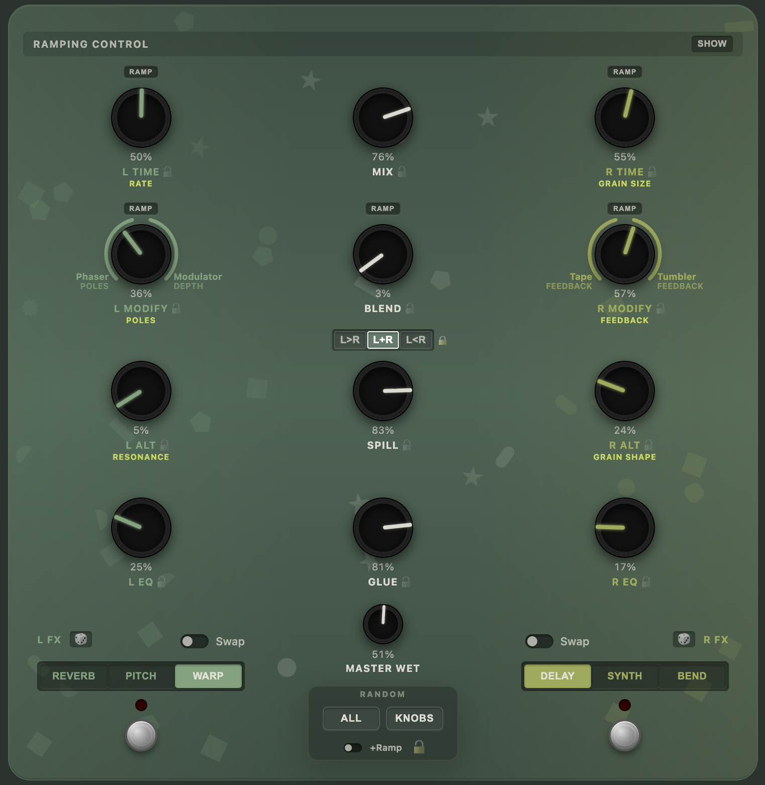
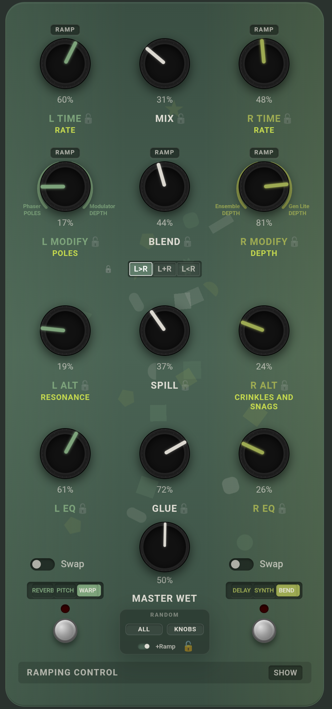
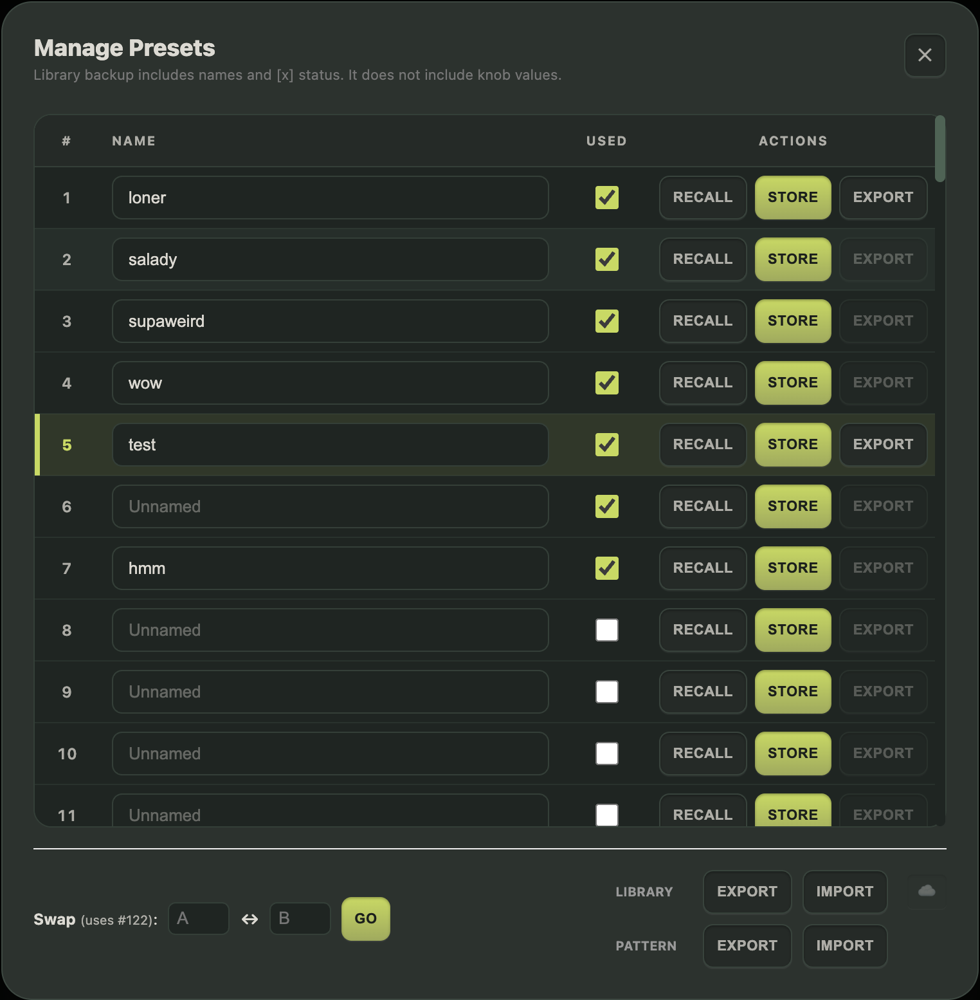

# Lost + Found MIDI Editor and Preset Manager

A web-based MIDI editor for the [**Chase Bliss Lost + Found**](https://www.chasebliss.com/lost-and-found) dual-engine effects pedal. Control every parameter, manage presets, and explore the full sonic palette of this powerful ambient machine—all from your browser.


---



## Features

- **Full MIDI Control** — Adjust all 12 knobs, effect selections, routing, and DIP switches via Web MIDI
- **Visual Knob Interface** — Drag-to-adjust knobs with real-time value display and smooth rotation
- **Dynamic Labels** — Dynamic labels show different sub-titles for knobs depending on the selected effect!
- **Preset Management** — Store, recall, rename, and organize up to 122 presets
- **Cloud Sync** — Optional Google sign-in to backup your preset library across devices
- **Randomizer** — Generate fresh patches instantly (all parameters, knobs only, or per-column)
- **Lock System** — Lock specific knobs to preserve values during randomization or preset recall
- **Ramping Control** — Configure which knobs sweep automatically via the pedal's ramping engine
- **Tap Tempo** — Send tap tempo messages synced to the pedal's clock
- **Export/Import** — Save individual presets or your entire library as JSON files
- **Alt-Key Tooltips** — Hold `Alt/Option` to see detailed descriptions of every control
- **Responsive Design** — Works on desktop, tablet, and mobile
- **Session Persistence** — All settings automatically saved to browser storage between sessions

<p align="center">
  
</p>

## Getting Started

### Prerequisites

- A modern browser with [Web MIDI API](https://developer.mozilla.org/en-US/docs/Web/API/Web_MIDI_API) support (Chrome, Edge, Opera)
- A MIDI interface connected to your Chase Bliss Lost + Found pedal
- Node.js 18+ (for local development)

### Installation

```bash
# Clone the repository
git clone https://github.com/your-username/lost-found-midi-editor.git
cd lost-found-midi-editor

# Install dependencies
npm install

# Start the development server
npm run dev
```

Open `http://localhost:5173` in your browser.

### Production Build

```bash
npm run build
npm run preview
```

The built files will be in the `dist/` folder, ready to deploy to any static hosting service.

---

## User Guide

### Connecting Your Pedal

1. Click **Enable MIDI** in the top toolbar
2. Grant MIDI permissions when prompted
3. Select your MIDI output device from the dropdown
4. Choose the MIDI channel (1-16) that matches your pedal's setting

Once connected, all knob changes are sent to the pedal in real-time.

### The Knob Grid

The main interface mirrors the Lost + Found's physical layout:

| Left Column | Center Column | Right Column |
|------------|---------------|--------------|
| L Time | Mix | R Time |
| L Modify | Blend | R Modify |
| L Alt | Spill | R Alt |
| L EQ | Glue | R EQ |

**Knob Interaction:**
- **Drag vertically** to adjust values (up = increase, down = decrease)
- **Double-click** to reset to default value
- **Shift + drag** for fine adjustment
- The percentage value displays above each knob

### Effect Selection

Below the knob grid, select effects for each channel:

| Left FX | Routing | Right FX |
|---------|---------|----------|
| Reverb / Pitch / Warp | L>R / L+R / L<R | Delay / Synth / Bend |

- **Swap** toggle reveals the alternate effect bank (Delay/Synth/Bend ↔ Reverb/Pitch/Warp)
- **Engage** toggles whether that effect channel is active
- **Footswitch** buttons simulate the physical footswitches (short press = engage, long press = hold mode)
- The **LED** indicates active/hold status

### Modify Knobs & Arc Labels

The L Modify and R Modify knobs blend between two variants of each effect:
- **A variant** (fully counter-clockwise)
- **B variant** (fully clockwise)

The colored arc shows the current blend position, with labels identifying which specific effect variations are at each end.

### Locking Parameters

Click the **lock icon** (🔓/🔒) next to a parameter to lock it:
- Locked knobs are **preserved during randomization**
- Locked knobs are **preserved during preset recall**
- Useful for keeping your Mix, EQ, or other settings consistent

The **Unlock All** button (🔓) in the Random section clears all locks.

### Randomization

| Button | Action |
|--------|--------|
| **ALL** | Randomizes effects, routing, and all knobs |
| **KNOBS** | Randomizes only knob values |
| **🎲** (per-column) | Randomizes just that column's effect + knobs |

Check **+Ramp** to include ramping parameters in the randomization.

### Preset Management

**Quick Actions (Top Bar):**
- **Slot dropdown** — Select preset slot (0-122, where 0 = Live buffer)
- **Recall** — Load the selected preset from the pedal
- **Store** — Save current settings to the selected slot

**Cloud-Based Preset Manager (Manage button):**
- View all 122 slots with names and status
- Mark slots as "Used" to help track which are occupied
- Rename presets inline
- Export/Import individual presets as JSON
- **Swap** two preset slots on the pedal (useful for reordering)
  - *Note: Swapping uses **slot 122** as a temporary buffer. Any preset stored in slot 122 will be overwritten during a swap operation.*

> **⚠️ Important: One-Way Communication**
> The interface cannot read current knob positions from the pedal.
> - Only values **edited within the web interface** are stored in the library/cloud.
> - If you tweak knobs physically on the pedal and then save, those physical changes **will not** be reflected in the saved preset.
> - Always adjust parameters in the editor if you intend to save them to your library.



### Cloud Sync

Optional Google sign-in enables cloud backup:

1. Click the **☁️** icon in the top bar
2. Sign in with Google
3. Enable **Auto-Sync** to automatically backup changes

Manual options:
- **Upload to Cloud** — Overwrite cloud backup with local data
- **Download from Cloud** — Restore from cloud backup

> Cloud sync stores preset names and metadata only, not knob values (those live on the pedal).

### Ramping Control

The Lost + Found's ramping system allows knobs to sweep automatically:

1. Expand the **Ramping Control** section
2. Toggle **Enabled** to activate ramping globally
3. Click the **RAMP** pill beneath any knob to include it in the sweep
4. Adjust **Ramp Speed** to control how fast knobs sweep
5. **Bounce** — Oscillate back and forth vs. resetting to start
6. **Sweep** — Invert the sweep direction

### Stereo Options

- **MISO** — Mono In Stereo Out
- **Spread DIP** — Enables the Spread control
- **Spread** — Which effects to use stereo spread with

### Clock / Tempo

- **Tap** button — Send tap tempo to the pedal
- **MIDI Clock Follow** — Sync to incoming MIDI clock
- **Unsync** — Let L and R time parameters run independently
- **L/R Tap Subdivision** — Set note divisions when synced

### General Settings (DIP Switches)

| Setting | Description |
|---------|-------------|
| **Latch** | Tap to toggle effect (vs. hold-to-engage) |
| **Trails** | Effects trail off naturally when bypassed |
| **Bank** | Enable preset bank mode for MIDI program changes |
| **Polarity** | Invert expression pedal polarity |

---

## Keyboard Shortcuts

| Key | Action |
|-----|--------|
| `Alt` / `Option` (hold) | Show tooltips for all controls |

---

## Technical Details

### Architecture

```
src/
├── main.ts              # App entry point & UI orchestration
├── components/          # UI components (Knob, TriBlock, Controls)
├── services/            # Business logic (MIDI, State, Presets, Cloud)
├── config/              # JSON configs (knobs, effects, tooltips)
├── styles/              # CSS styling
├── types/               # TypeScript type definitions
└── utils/               # Helper functions
```

### MIDI Implementation

- Uses the [Web MIDI API](https://developer.mozilla.org/en-US/docs/Web/API/Web_MIDI_API)
- Sends CC messages for knob values (0-127)
- Sends Program Change messages for preset recall
- Supports MIDI SysEx for preset store operations

### Browser Support

| Browser | Support |
|---------|---------|
| Chrome | Full |
| Edge | Full |
| Opera | Full |
| Firefox | Partial (requires Web MIDI extension) |
| Safari | Not supported (no Web MIDI API) |

---

## Contributing

Contributions are welcome! Please:

1. Fork the repository
2. Create a feature branch (`git checkout -b feature/amazing-feature`)
3. Commit your changes (`git commit -m 'Add amazing feature'`)
4. Push to the branch (`git push origin feature/amazing-feature`)
5. Open a Pull Request

---

## Acknowledgments

- **Chase Bliss Audio** for creating the [Lost + Found](https://www.chasebliss.com/lost-and-found) pedal
- Inspired by [PedalPylot](https://pedalpylot.com). Please consider [donating to support Phil G Music](https://www.paypal.com/paypalme/philgmusic).
- Support the developer of this web editor on [Patreon](https://patreon.com/function_store)
- Built with [Vite](https://vitejs.dev/) and [TypeScript](https://www.typescriptlang.org/)
- Cloud sync powered by [Firebase](https://firebase.google.com/)

---

## License

This project is licensed under the MIT License - see the [LICENSE](LICENSE) file for details.

---

<p align="center">
  <em>Not affiliated with Chase Bliss Audio. This is an independent community project.</em>
</p>
